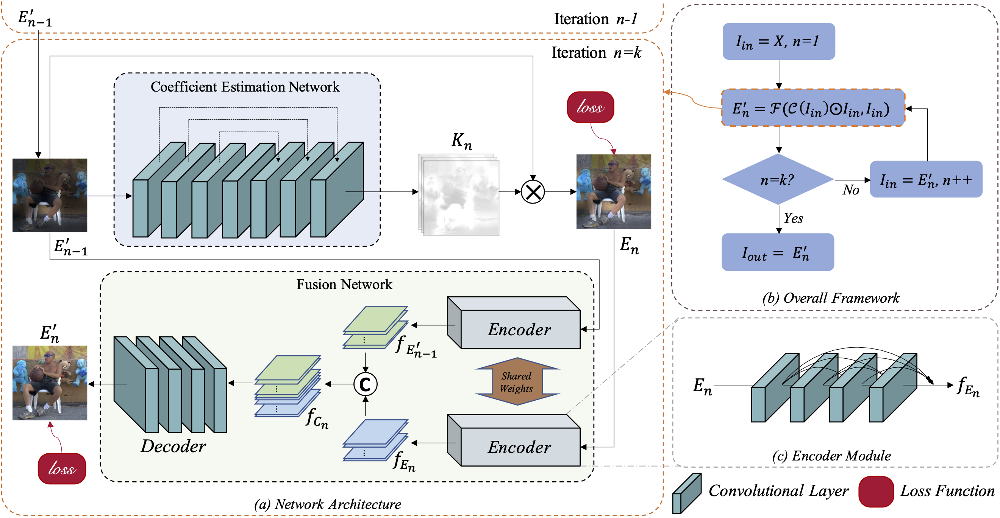

# EFINet: Restoration for Low-light Images via Enhancement-Fusion Iterative Network

<p align="center">
  <a href="https://doi.org/10.1109/TCSVT.2022.3195996"></a>
  
  
  
  <a href="https://github.com/kyrie111/EFINet/stargazers"></a>
</p>

> **EFINet: Restoration for Low-light Images via Enhancement-Fusion Iterative Network**
> Chunxiao Liu, Fanding Wu, Xun Wang
> *IEEE Transactions on Circuits and Systems for Video Technology (TCSVT)*, vol. 32, no. 12, pp. 8486–8499, 2022.
> [[Paper]](https://doi.org/10.1109/TCSVT.2022.3195996) · [[PDF]](data/EFINet.pdf)

This repository contains the **official PyTorch implementation** of EFINet, a lightweight enhancement-fusion iterative network for restoring low-light images.

<p align="center">
  
</p>

---

## Highlights

- **Iterative enhancement-fusion design** that progressively refines low-light images through repeated passes.
- **Lightweight and fast**, suitable for both synthetic and real-world low-light scenes.
- **Ready-to-use checkpoint** (`snapshots/BestEpoch.pth`) and test images for immediate reproduction.

## Installation

The code was developed and tested with the following environment:

| Dependency  | Version |
|-------------|---------|
| Python      | 3.7     |
| PyTorch     | 1.4.0   |
| torchvision | 0.2.1   |
| CUDA        | 10.1    |

We recommend using a dedicated Conda environment:

```bash
# Clone the repository
git clone https://github.com/kyrie111/EFINet.git
cd EFINet

# Create and activate the environment
conda create -n efinet python=3.7 -y
conda activate efinet

# Install dependencies
conda install pytorch==1.4.0 torchvision==0.2.1 cudatoolkit=10.1 -c pytorch
pip install numpy opencv-python
```

## Quick Start: Inference

A pretrained checkpoint is provided at `snapshots/BestEpoch.pth`.

1. Place your low-light images inside subfolders of `data/test_data/`
   (the repository already ships with `real-world image/` and `synthetic image/` samples).
2. Run inference:

   ```bash
   python lowlight_test.py
   ```

3. Enhanced results are written to `data/result/`, preserving the input subfolder structure.

> The model is applied iteratively (three passes by default) to progressively brighten and restore each image. Per-image processing time is printed to the console.

## Repository Structure

```
EFINet/
├── model.py             # EFINet network definition
├── dataloader.py        # Dataset and data loading
├── Myloss.py            # Loss functions
├── ms_ssim.py           # MS-SSIM metric / loss
├── lowlight_train.py    # Training entry point
├── lowlight_test.py     # Inference entry point
├── snapshots/           # Pretrained checkpoint (BestEpoch.pth)
├── utils/               # Helper utilities
└── data/                # Test images, architecture figure, paper PDF
```

## Citation

If you find this work useful for your research, please consider citing our paper:

```bibtex
@ARTICLE{liu2022efinet,
  title   = {EFINet: Restoration for Low-light Images via Enhancement-Fusion Iterative Network},
  author  = {Liu, Chunxiao and Wu, Fanding and Wang, Xun},
  journal = {IEEE Transactions on Circuits and Systems for Video Technology},
  year    = {2022},
  volume  = {32},
  number  = {12},
  pages   = {8486-8499},
  doi     = {10.1109/TCSVT.2022.3195996}
}
```

## Contact

For questions about the paper or code, please open an [issue](https://github.com/kyrie111/EFINet/issues) or contact the authors.

## License

This project is released for academic research purposes. Please refer to the repository for license details.
